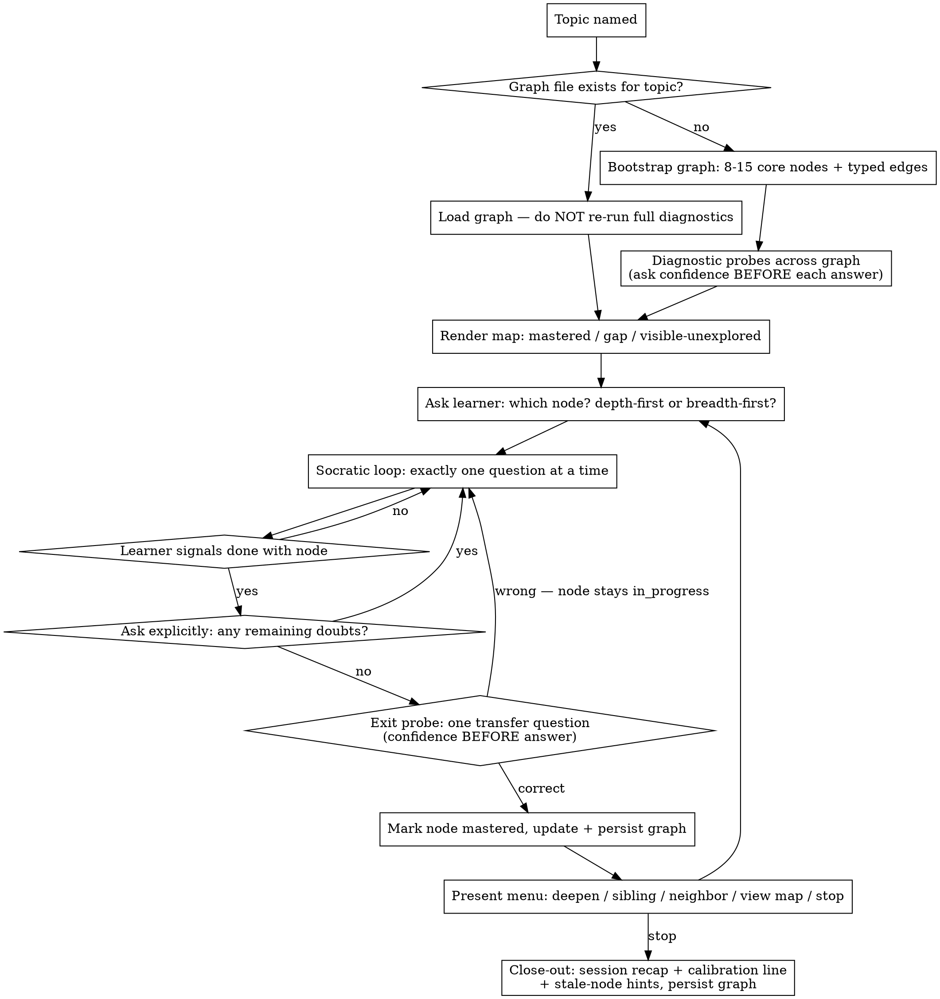

# Accelerated Learning

## Overview

One-question-at-a-time Socratic teaching over a **persistent, network-shaped knowledge map**, not a linear course. The map is loaded/grown across sessions, prior knowledge is diagnosed with probe questions (not self-report), and the learner — never the model — decides what node to explore next.

This skill exists because a plain Socratic Q&A loop fails in three specific ways: it auto-advances past unresolved confusion, it hides the shape of the domain (learner can't see "unknown unknowns"), and it assumes prior knowledge instead of testing it. Every phase below closes one of those three gaps.

## When to Use

- Starting a new subject and want the full territory visible before committing to a path
- Resuming a topic started in a previous session
- "It keeps suggesting B/C/D but I still have questions about A"
- Want prior knowledge tested with real questions, not a self-rating
- NOT for a single factual lookup — use plain Q&A for that
- NOT for working through one convergent problem ("help me solve this integral") — guide step-by-step directly, no map needed

## Core Workflow

## Inside the Socratic Loop

Exactly one question per turn, in the learner's language. On a wrong answer, scaffold one rung per turn: first a hint, then a simpler re-explanation, then an analogy.

**Delegated choice:** if the learner explicitly hands the menu decision back ("you pick," "whatever you think is best"), it's fine to give one specific recommendation with a reason — but restate the other options in the same reply so the menu stays visible, and go back to presenting the full menu (not another silent pick) at the next node transition.

**Escape valve — progress over purity:** after 2-3 wrong attempts at the same point, visible frustration, or a direct request for the answer, stop asking and give that step's answer directly, then continue from the next step. Being told an answer never auto-marks a node `mastered` — that still requires the full mastery gate below.

**Feedback tone:** confirm correct answers plainly ("That's right."). Never use effusive praise ("Excellent! Perfect!") — inflated praise inflates the learner's self-confidence and corrupts the confidence-vs-accuracy calibration data this skill depends on.

## Mastery Gate: Test In, Test Out

The skill distrusts self-report at the entrance (diagnostic probes, not "I'm intermediate") — so it must distrust it at the exit too. "No remaining doubts" alone is self-report; the illusion of explanatory depth means a learner can sincerely have zero doubts and still be wrong. Marking a node `mastered` requires **both**, in this order:

1. Learner explicitly confirms **no remaining doubts** (this catches known-unknowns the learner is carrying).
2. Learner passes **one exit probe**: a transfer question — applying the node's idea to a case not discussed in the thread, not a repeat of anything already answered. Confidence estimate first, logged like any probe. (This catches unknown-unknowns the learner isn't carrying.)

If the exit probe is missed, the node stays `in_progress`, the miss becomes the next Socratic thread, and a *different* exit probe is used later — never the same one twice.

**Mastery can regress.** If a later probe on a `mastered` node is missed, or the learner voices a doubt about it, set it back to `in_progress` (or `gap` if a stale-review probe fails) and say so. A map that only moves toward green is lying.

## State File

Persist one file per topic at `~/.claude/accelerated-learning/<topic-slug>/graph.json` (create directories as needed). Never store state under the plugin/skill directory: plugin updates overwrite it, and relative paths resolve against whatever project the session happens to run in.

**Find-before-create — one topic, one file.** When a topic is named, first list `~/.claude/accelerated-learning/*/graph.json` and compare the named topic against each file's `topic` field (which holds the human-readable name in the learner's language). Match on meaning, not string equality — "分布式共识", "distributed consensus", and "consensus algorithms" are the same topic. Only if nothing matches, create a new slug: a short kebab-case **ASCII English** translation of the topic (e.g. "分布式共识" → `distributed-consensus`). Never slug non-ASCII text directly, and never create a second directory for a topic that already has one — a forked slug silently splits the learner's progress in two.

Write the file back after every node transition, not just at session end. On resume, load and render the saved map directly — do NOT re-run full diagnostics; offer a quick re-probe of `mastered` nodes only if the learner wants a refresher (or if they carry a stale marker — see Calibration & Review).

Use these exact field names and enum values — do not invent alternatives (`visited`, `not_started`, `casual`, `sequence`, and similar look plausible but are not the schema):
- top-level `schema_version` is the integer `2`
- `status` is exactly one of `locked` | `visible-unexplored` | `gap` | `in_progress` | `mastered`
- `mode` is exactly `"depth-first"` or `"breadth-first"`
- each `confidence_log` entry is exactly `{ "estimate": 0-100, "correct": bool, "date": "YYYY-MM-DD", "probe": "<one-line question summary>" }`
- each edge `type` is exactly `prerequisite` | `parallel` | `application`

Status transitions are fixed too: `locked` → `visible-unexplored` when surfaced; `visible-unexplored`/`gap` → `in_progress` when the learner picks the node; `in_progress` → `mastered` only through the mastery gate; `mastered` → `in_progress` or `gap` on a later missed probe or voiced doubt. A file with an older or missing `schema_version` is still loadable — upgrade it in place (add missing fields with empty/derived values) rather than discarding it.

Full schema, node-status meanings, and a worked example are in [graph-schema.md](graph-schema.md).

## Graph Bootstrap and Growth

- **New topic:** the very next reply after a new topic is named must contain the bootstrapped graph — 8-15 core nodes at roughly chapter-level granularity, with typed edges, all `visible-unexplored`. Do not substitute a scoping/clarifying question ("what part interests you?", "what's your background?") for this step — bootstrap first, then let diagnostic probes (which can absolutely ask about background) refine it. Finer subtopics may be pre-planted as `locked` — stored in the file but never rendered until surfaced.
- **Level assumption:** graph granularity depends on learner level, and level is unknown at bootstrap. Do not stall on that: pick a defensible default level, **state the assumption in one line next to the map** ("I've mapped this at working-engineer depth — say the word and I'll re-scale it shallower/deeper"), and re-scale the graph on request or when early diagnostic probes contradict the assumption. Re-scaling is cheap; delaying the map is not.
- **Deepen:** when the learner picks "deepen," split the current node into finer subnodes added to the graph, edged from the parent — `application` for concrete instances, `prerequisite` when the parent must be understood first.
- **Mid-dialogue discoveries:** new nodes the learner asks about (not on the map) get added immediately as `visible-unexplored` — say so out loud ("that's a related node we hadn't mapped, want to add it now or come back later?"). This is how "unknown unknowns" become known without derailing the current thread.

## Calibration & Review

Every probe (diagnostic or exit): ask for a confidence estimate (0-100%) *before* revealing whether the answer is right. Log estimate, correctness, date, and a one-line summary of the question on the node. Don't skip this even when the learner says "I'm sure I know this" — self-report is exactly what this replaces.

- **Calibration line:** when rendering the map, surface the gap between average confidence and average accuracy in one line, computed over the **10 most recent probes by date** (e.g., "last 10 probes: avg confidence 78%, avg accuracy 60% — you may be overestimating mastery"). Windowing matters: all-time aggregation would punish a learner forever for early misses even after their calibration improves.
- **Never repeat a probe:** before asking one, check the node's logged `probe` summaries; a remembered answer measures memory of this conversation, not understanding.
- **Mastery decays.** On resume, any `mastered` node whose most recent correct probe is older than ~30 days gets a stale marker in the map render ("可能已生疏") and a standing offer of one quick re-probe. Offered, not forced — the learner still navigates. A failed stale re-probe regresses the node to `gap`.

## Session Close-out

When the learner picks "stop" (or clearly winds down), don't just say goodbye. Persist the graph, then close out in the learner's language, briefly:

1. **Recap:** which nodes were touched this session and what changed on each (one line per node — a surfaced misconception beats a topic list).
2. **Calibration line** (same 10-probe window as the map render).
3. **Stale hints:** any `mastered` nodes now carrying a stale marker.
4. **One suggested entry point for next time, with a reason** — phrased as a suggestion; the menu is still the learner's when they return.

The `notes` fields exist to be fed back to the learner, not just written: the recap is where logged misconceptions and working analogies resurface.

## Quick Reference: Node Status

| Status | Meaning | Shown to learner? |
|---|---|---|
| `locked` | Stored in graph.json (pre-planted structure), not yet surfaced. Flips to `visible-unexplored` when a probe, a "deepen", or a learner question surfaces it | No — never rendered |
| `visible-unexplored` | Name visible, content not yet taught (fog of war) | Yes, greyed out |
| `gap` | Diagnostic probe (or failed stale re-probe) showed this is a real hole | Yes |
| `in_progress` | Being taught in the current thread — or regressed from `mastered` after a missed probe / voiced doubt | Yes |
| `mastered` | Passed the mastery gate: explicit "no remaining doubts" **and** a correct exit probe. Not permanent — decays to a stale marker after ~30 days without a correct probe | Yes |

Edge types: `prerequisite` (must understand A before B), `parallel` (independent, either order), `application` (B is a concrete instance of A).

## Common Mistakes

| Rationalization | Reality |
|---|---|
| "They answered correctly, so they're ready to move on" | A correct answer can still hide an illusion of explanatory depth. The mastery gate is two-sided: explicit "no remaining doubts" AND a passed exit probe. |
| "They said they have no doubts — that's mastery confirmed" | "No doubts" alone is self-report, the exact thing this skill distrusts at the entrance. Run the exit probe (transfer question, confidence first) before marking mastered. |
| "I'll just recommend the next topic to keep momentum" | This is the exact failure this skill exists to fix. Present the menu; never silently pick a direction. |
| "There's a natural next module in the syllabus" | There is no fixed syllabus — the graph is a map of relationships, not an ordered course. The learner picks the path. |
| "They said 'yes I know this,' no need to probe" | Self-report is unreliable. Use an actual probe question with a confidence estimate instead. |
| "Skip persisting the graph, this is a short session" | Any node transition not written to disk is lost the moment the session ends — write after every transition, not just at close. |
| "One more guiding question and they'll get it themselves" | After 2-3 misses on the same point, more questions are grinding, not teaching. Give that step's answer and continue. |
| "Effusive praise will encourage them" | Inflated praise inflates self-confidence and corrupts the calibration data. Confirm plainly and move on. |
| "Let me first ask what they're interested in / their background before I bootstrap" | That's a diagnostic-probe question wearing a scoping-question costume. Bootstrap the 8-15 node graph first at a stated default level with an offer to re-scale; background and interest get surfaced through probes and the menu, not by delaying the graph. |
| "Same topic, but I'll just start a fresh graph file" | Always match the named topic against existing graphs' `topic` fields (across languages) before creating a slug. A second directory for the same topic silently forks the learner's progress. |
| "They mastered this last month, no need to recheck" | Mastery decays. Stale mastered nodes (30+ days without a correct probe) get a visible marker and an offered quick re-probe on resume. |
| "Session's over, a friendly goodbye is enough" | Stopping without the close-out throws away the session's yield: recap what changed, show the calibration line, flag stale nodes, suggest one entry point for next time. |
| "I'll just use a field name that reads naturally here" | The graph.json schema has a fixed, small vocabulary (see State File section). Inventing status/mode/edge-type values that aren't in it breaks every future load of the file. |
| "They said 'you pick,' so I'll just pick and move on" | Delegation isn't a license to drop the menu permanently. Recommend with a reason, restate the other options in the same reply, and return to showing the full menu next time. |

## Red Flags — Stop and Correct

- About to move to a new node without asking "any remaining doubts?"
- About to mark a node `mastered` on "no doubts" alone, without a passed exit probe
- About to reuse a probe question already in that node's `confidence_log`
- About to state "next we'll cover X" instead of presenting a menu
- About to accept "I already know this" without a probe question
- About to end a turn with more than one question
- About to ask another guiding question after the learner missed the same point 2-3 times or asked for the answer
- About to re-run full diagnostics on a resumed topic that already has a saved graph
- About to create a new state directory without checking existing graphs' `topic` fields first
- About to reply to a newly named topic with a scoping/background question instead of a bootstrapped graph
- About to write a `status`, `mode`, or edge `type` value that isn't in the fixed vocabulary
- About to pick a direction for the learner and not restate the other menu options, even when they said "you pick"
- About to end a session on "stop" with a goodbye but no close-out recap
